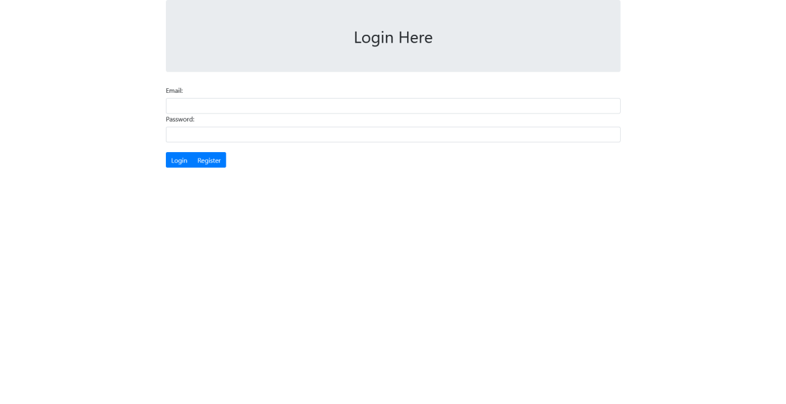
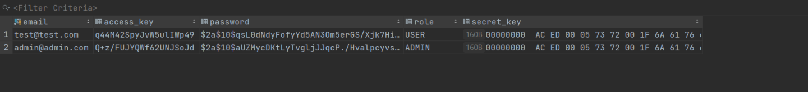
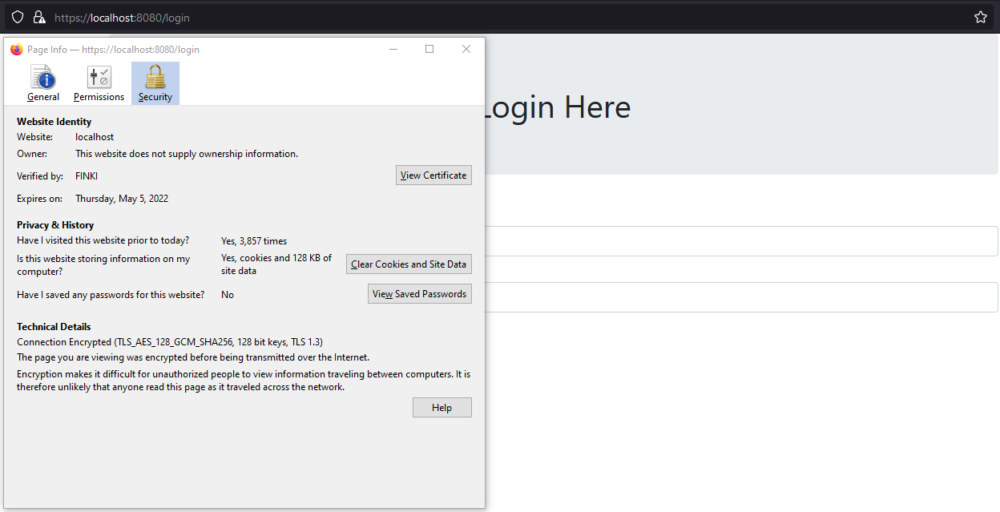
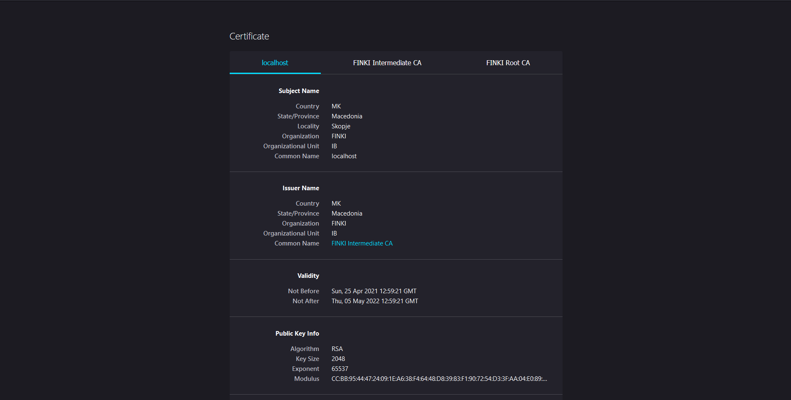
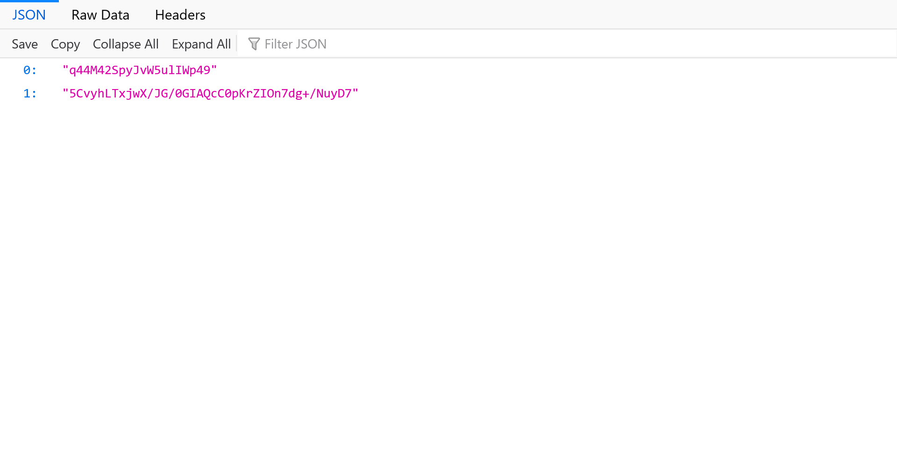
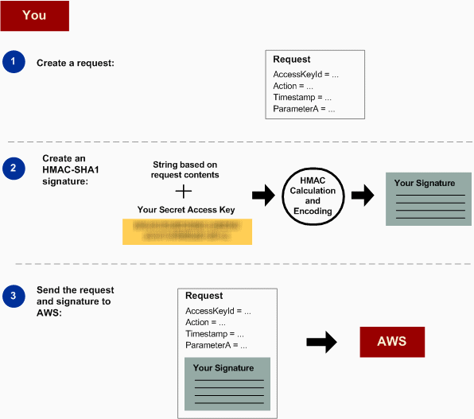
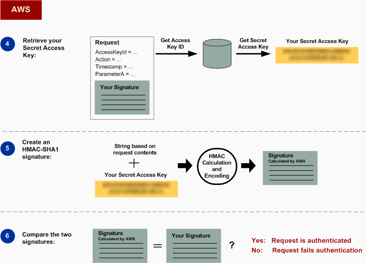

## REST API со signed endpoints

--------

###	Опис на проектот

Web апликација која овозможува креирање на нов корисник со лозинка и корисничко име и со истите може да се најави на Web сајтот. Апликацијата е базирана на МVC парадигма.


#### Страница за најава



#### Страница за регистрација


#### Чување на лозинки



Лозинките се чуваат хеширани во базата.
Постојат два типа на авторизација администратор (Admin)  и корисник (User). Дозволени функции на корисникот се GET барање со кои само може да превзема податоци од серверот, додатно администраторот има привилегии за PUT и DELETE барање со кои може да внесува и пребришува податоци соодветно.

Апликацијата се извршува на web сервер каде е овозможена https комуникација.



Имаме PKI каде сертификатот на серверот е потпишан од intermediate CА, а тој пак е потпишан од root CA.



Со креирање на нов корисник на сајтот, корисникот ќе добие клуч за пристап и таен клуч. 



Со тајниот клуч при секое барање се креира потпис со кој се овозможува автентикација на корисникот.

#### Улога на корисникот



Кога серверот ќе го добие барањето тој со корисничкиот клуч за пристап го наоѓа тајниот клуч на корисникот од базата каде што е сместен и креира ист потпис со тајниот клуч и ги споредува потписите, доколку се исти корисникот се автентицира, но доколку не се исти корисникот не се автентицира.

#### Улога на серверот



## Имплементација

-----

### Модели

Класта Account се користи за чување на податоците на корисници кои ќе прават HTTP барања.

```java
@Entity(name = "AccountTable")
@Data
public class Account {

    @Id
    private String email;

    private String password;

    private String accessKey;

    private SecretKey secretKey;

    @Enumerated(EnumType.STRING)
    private Role role;

    public Account() {
    }

    public Account(String email, String password, SecretKey accessKey, SecretKey secretKey, Role role) {
        this.email = email;
        this.password = password;
        this.accessKey = Base64.encodeBase64String(accessKey.getEncoded());
        this.secretKey = secretKey;
        this.role = role;
    }

    public String getSecretKeyEncoded() {
        return Base64.encodeBase64String(secretKey.getEncoded());
    }

    public String getAccessKeyEncoded() {
        return accessKey;
    }
}
```

User класата се користи за чување на случајно генерирани податоци на луѓе, кои се добиваа при успешено направено барање 
во JSON формат.

```java

@Data
@Entity(name = "UsersTable")
public class User {

    @Id
    @GeneratedValue(strategy = GenerationType.IDENTITY)
    private Long id;

    private String name;

    private String email;

    private String phone;

    private String country;

    public User() {
    }

    public User(String name, String email, String phone, String country) {
        this.name = name;
        this.email = email;
        this.phone = phone;
        this.country = country;
    }
}
```

Енумерација Role се користи за поставување на авторизација на корисниците (од класата Account). Има 2 типа на 
привилегии и тоа обичен корисник (USER) и администратор (ADMIN).

```java
public enum Role {
    ADMIN,
    USER
}
```

### Репозиториуми
AccountRepository наследува од JpaRepository<Account, String> каде освен основните CRUD има и две дополнителни фукнции за
наоѓање на Account според email и accessKey. 

```java
@Repository
public interface AccountRepository extends JpaRepository<Account, String> {

    // Го наоѓа Account кој ја содржи вредноста за е-маил наведена во аргументот.
    Optional<Account> findByEmail(String email);
   
    // Го наоѓа Account кој ја содржи вредноста за клуч за пристап наведена во аргументот.
    Optional<Account> findByAccessKey(String accessKey);
}
```

UserRepository наследува од JpaRepository<User, Long> и има две дополнителни фукции.

```java
@Repository
public interface UserRepository extends JpaRepository<User, Long> {
    
    // Ги враќа сите корисници во листа кои вредноста на променливата за државата (country) е иста како во аргументот 
    // на функцијата.
    List<User> findAllByCountryContaining(String country);
    
    // Ги враќа сите корисници во листа кои вредноста на променливата за телефонскиот број (phone) е иста како во 
    // аргументот на функцијата.
    List<User> findAllByPhoneContaining(String phone);
}
```

### Сервиси

Интерфејсот AccountService кој содржи 3 функции.

```java
@Service
public interface AccountService {

    // Функција со која се регистрира корисник (од класата Account).
    Optional<Account> register(String email, String password);

    // Функција со која се најавува корисник (од клата Account).
    Optional<Account> login(String email, String password);

    // Функција со која се наоѓа корисникот ( од класата Account) со иста вредност на клучот за пристап како наведениот 
    // аргумент.
    Optional<Account> findByAccessKey(String accessKey);
}
```

Интерфејсот UserService кој содржи 5 функции.

```java
@Service
public interface UserService {

    // Ф ункција која враќа листа од сите корисници (од класата User).
    List<User> getAll();

    // Функција која враќа листа од сите корисници (од класата User) кои за вредноста на променливата за држава е иста 
    // со аргументот на функцијата.
    List<User> getAllByCountry(String country);

    // Функција која враќа листа од сите корисници (од класата User) кои за вредност на променливата за телефонски 
    // број е иста со аргументот на функцијата.
    List<User> getAllByPhone(String phone);

    // Функција која запишува нов корисник (од класата User) ,со податоци проследени од аргументите на функцијата, 
    // во базата на податоци.
    Optional<User> putNewUser(String name, String email, String phone, String country);

    // Функција која брише корисник (од класата User) со ид како во аргументот на функцијата од базата на податоци.
    Optional<User> deleteUser(Long id);
}
```

Интерфејсот UtilsService кој содржи 3 функции.

```java
public interface UtilsService {
    
    // Функција која генерира таен клуч.
    SecretKey generateSecretKey();

    // Функција која генерира клуч за пристап.
    SecretKey generateAccessKey();

    // Функција која служи за генерирање на потпис.
    String signature(SecretKey secretKey, String stringToSign);
}
```

### Имплементација на сервисите

Класата AccountServiceImpl која го имплементира интефејсот AccountService.

```java
@Service
public class AccountServiceImpl implements AccountService {
    
    private final AccountRepository accountRepository;
    private final PasswordEncoder passwordEncoder;
    private final UtilsService utilsService;

    public AccountServiceImpl(AccountRepository accountRepository, PasswordEncoder passwordEncoder, UtilsService utilsService) {
        this.accountRepository = accountRepository;
        this.passwordEncoder = passwordEncoder;
        this.utilsService = utilsService;
    }

    // Функција со која се регистрира нов корисник така што се проверува дали веќе посои е-маил кој е проследен во 
    // функцијата и доколку постои не се дозволува да се регистрира корисникот, но доколку не посои се овозможува 
    // корисникот да се регистрира. Лозинката се енкодира со енкодер за лозинки и се генерираат клучевите со функции од
    // UtilService класта која е објаснета подолу.
    @Override
    public Optional<Account> register(String email, String password) {
        if (accountRepository.findByEmail(email).isPresent()) {
            return Optional.empty();
        }
        String encPass = passwordEncoder.encode(password);
        SecretKey accessKey = utilsService.generateAccessKey();
        SecretKey secretKey = utilsService.generateSecretKey();
        Account account = new Account(email, encPass, accessKey, secretKey, Role.USER);
        accountRepository.save(account);
        return Optional.of(account);
    }

    // Функција со која се овозможува да се најави корисникор (од класата Account)  со проследените аргументи се 
    // провервуа дали постои корисник со таа е-маил адресата и доколку не постои не се овозможува најавување, но 
    // доколку постои се проверува дали проследената лозинка е точна доколку е точна корисникот се најавува на сајтот.
    @Override
    public Optional<Account> login(String email, String password) {
        Optional<Account> account = accountRepository.findByEmail(email);
        if (account.isEmpty()) {
            return Optional.empty();
        }
        if (passwordEncoder.matches(password, account.get().getPassword())) {
            return account;
        }
        return Optional.empty();
    }

    // Функција која го враќа корисникот (од класата Account ) со ист клуч за пристап како во аргументот.
    @Override
    public Optional<Account> findByAccessKey(String accessKey) {
        return accountRepository.findByAccessKey(accessKey);
    }
}
```

Класата UserServiceImpl која го имплементира интефејсот UserService.

```java
@Service
public class UserServiceImpl implements UserService {

    private final UserRepository userRepository;

    public UserServiceImpl(UserRepository userRepository) {
        this.userRepository = userRepository;
    }

    // Фукција која ги враќа сите корисници.
    // Повеќето од фукциите се имплементирани во UserRepository и само се повикуваат.
    @Override
    public List<User> getAll() {
        return userRepository.findAll();
    }

    // Фукција која ги враќа сите корисници според држава.
    @Override
    public List<User> getAllByCountry(String country) {
        return userRepository.findAllByCountryContaining(country);
    }

    // Фукција која ги враќа сите корисници според телефонски број.
    @Override
    public List<User> getAllByPhone(String phone) {
        return userRepository.findAllByPhoneContaining(phone);
    }

    // Фукција која креира нов корисник и го зачувува во базата.
    @Override
    public Optional<User> putNewUser(String name, String email, String phone, String country) {
        User user = new User(name, email, phone, country);
        userRepository.save(user);
        return Optional.of(user);
    }

    // Фукција која брише корисник според id.
    @Override
    public Optional<User> deleteUser(Long id) {
        Optional<User> user = userRepository.findById(id);
        user.ifPresent(userRepository::delete);
        return user;
    }
}
```

Класата UtilsServiceImpl која го имплементира интефејсот UtilsService.

```java

@Service
public class UtilsServiceImpl implements UtilsService {

    private final KeyGenerator keyGenerator;

    public UtilsServiceImpl(KeyGenerator keyGenerator) {
        this.keyGenerator = keyGenerator;
    }

    // Функција која со генераторот за таен клуч генерира клуч од 240 бајти.
    @Override
    public SecretKey generateSecretKey() {
        keyGenerator.init(240);
        return keyGenerator.generateKey();
    }

    // Функција која генерира клуч за пристап од 120 бајти.
    @Override
    public SecretKey generateAccessKey() {
        keyGenerator.init(120);
        return keyGenerator.generateKey();
    }

    // Функција која проследениот String и проследениот таен клуч го потпишува String-от така што креира MAC од тип 
    // HMACSHA1. МАC-oт се иницијализра со клучот и го порпишува String-от. Враќа String енкодиран со Base64.
    @Override
    public String signature(SecretKey secretKey, String stringToSign) {
        try {
            Mac mac = Mac.getInstance("HMACSHA1");
            mac.init(secretKey);
            return Base64.encodeBase64String(mac.doFinal(stringToSign.getBytes()));
        } catch (NoSuchAlgorithmException | InvalidKeyException e) {
            System.out.println(e.getMessage());
        }
        return "Invalid";
    }
}
```

### Контроллери
Класата ApiController се справува со барањата на податоци за корисниците кои ги враќа во JSON формат.

```java
@RestController
@RequestMapping("/api")
public class ApiController {

    private final UserService userService;

    public ApiController(UserService userService) {
        this.userService = userService;
    }

    @GetMapping("/test")
    public ResponseEntity<String> getTest() {
        return ResponseEntity.ok("Hello World!!!");
    }

    // Функција која враќа листа од кориснци од базата.
    @GetMapping("/users")
    public ResponseEntity<List<User>> allUsers() {
        return ResponseEntity.ok(userService.getAll());
    }

    // Функција која враќа листа од кориснци кои имаат иста вредност на променливата country како и 
    // аргументот на функцијата.
    @GetMapping("/users/country/{country}")
    public ResponseEntity<List<User>> allUsersByCountry(@PathVariable String country) {
        return ResponseEntity.ok(userService.getAllByCountry(country));
    }

    // Функција која враќа листа од кориснци кои имаат иста вредност на променливата phone како и 
    // аргументот на функцијата.
    @GetMapping("/users/phone/{phone}")
    public List<User> allUsersByPhone(@PathVariable String phone) {
        return userService.getAllByPhone(phone);
    }

    // Функција која додава нов корисник во базата на податоци.
    @PutMapping("/users/put")
    public ResponseEntity<String> putUser(@RequestParam(required = false) String name,
                                          @RequestParam(required = false) String email,
                                          @RequestParam(required = false) String phone,
                                          @RequestParam(required = false) String country) {
        Optional<User> user = userService.putNewUser(name, email, phone, country);
        if (user.isPresent()) {
            return ResponseEntity.ok("Successful entry");
        } else {
            return ResponseEntity.badRequest().build();
        }
    }

    // Функција која брише корисник од базата на податоци.
    @DeleteMapping("/users/delete/{id}")
    public ResponseEntity<String> deleteUser(@PathVariable Long id) {
        Optional<User> user = userService.deleteUser(id);
        if (user.isPresent()) {
            return ResponseEntity.ok("user deleted");
        } else {
            return ResponseEntity.badRequest().build();
        }
    }
}
```

Класата LoginController служи за справување со барања при најавување и регистрирање.

```java
@Controller
public class LoginController {

    private final AccountService accountService;

    public LoginController(AccountService accountService) {
        this.accountService = accountService;
    }

    //  Функција која ја враќа страницата за највување.
    @GetMapping("/login")
    public String getLoginPage() {
        return "login.html";
    }

    // Функција која при успешно логирање ги враќа тајниот клуч и клучот за пристап на клиентот.
    @PostMapping("/login")
    public ResponseEntity<List<String>> loginAccount(@RequestParam String email, @RequestParam String password) {
        List<String> list = new ArrayList<>();
        accountService.login(email, password).ifPresent(account -> {
            list.add(account.getAccessKeyEncoded());
            list.add(account.getSecretKeyEncoded());
        });
        return ResponseEntity.ok(list);
    }

    // Функција која ја враќа страницата за регистритрање.
    @GetMapping("/register")
    public String getRegisterPage() {
        return "register.html";
    }

    // Функција која при успешно регистрирање ги враќа тајниот клуч и клучот за пристап на клиентот.
    @PostMapping("/register")
    public ResponseEntity<List<String>> registerAccount(@RequestParam String email, @RequestParam String password) {
        List<String> list = new ArrayList<>();
        accountService.register(email, password).ifPresent(account -> {
            list.add(account.getAccessKeyEncoded());
            list.add(account.getSecretKeyEncoded());
        });
        return ResponseEntity.ok(list);
    }
}
```

## Филтри
Класата SignatureFilter која го имплементира Filter служи за филтрирање на HTTP барањата.
 
```java

@WebFilter
@Component
public class SignatureFilter implements Filter {

    private final UtilsService utilsService;
    private final AccountService accountService;

    public SignatureFilter(UtilsService utilsService, AccountService accountService) {
        this.utilsService = utilsService;
        this.accountService = accountService;
    }

    // Функција која го креира стрингот за попишување.
    public String computeStringToSign(String httpVerb, String contentType, String date) {
        return httpVerb + "\n" +
                "" + "\n" +
                contentType + "\n" +
                date + "\n" +
                "" +
                "";
    }

    // Функција која го филтрира https барањето. Доколку барањето е за највување или регистриање корисникот не се 
    // автентицира туку се враќаат страниците за најава или регистрација. Потоа проверува дали клиентот успешно е 
    // автентициран, доколку не е се враќа повторно на страницата за автентикација (страница за најавување). Доколку 
    // датумот е невалиден ( постар од 15 минути) корисникот повторно се враќа на страницата за автентикација. Откако 
    // ќе се автентицира корисникот се проверува барањето доколку барањето е PUT или DELETE се проверува дали клиентот 
    // е авторизиран, доколку клиентот не е авторизиран за овие две барања го препаќа повторно да се најави. Доколку 
    // пак е авторизиран го проверува потписот на клиентот и доколку е ист со потписот на серверот клиентот добива 
    // пристап до страницата која е побарана во спртоивно се препраќа за повторна најава.
    @Override
    public void doFilter(ServletRequest servletRequest, ServletResponse servletResponse, FilterChain filterChain) throws IOException, ServletException {
        HttpServletRequest request = (HttpServletRequest) servletRequest;
        HttpServletResponse response = (HttpServletResponse) servletResponse;

        if (request.getServletPath().equals("/login") || request.getServletPath().equals("/register") || request.getServletPath().equals("/api/test")) {
            filterChain.doFilter(servletRequest, servletResponse);
        } else {
            String auth = request.getHeader("Authorization");

            if (auth == null || auth.isEmpty()) {
                response.sendRedirect("/login");
            } else {
                List<String> list = Arrays.asList(auth.split(":").clone());
                String accessKey = list.get(0);
                String signature = list.get(1);

                Optional<Account> account = accountService.findByAccessKey(accessKey);

                if (account.isEmpty()) {
                    response.sendRedirect("/register");
                } else {
                    String date = request.getHeader("Date");
                    if (date == null || date.isEmpty()) {
                        response.sendRedirect("/login");
                    } else {
                        LocalDateTime localDateTime = LocalDateTime.parse(date);
                        if (Duration.between(localDateTime, LocalDateTime.now()).toMinutes() > 15) {
                            response.sendRedirect("/login");
                        } else {
                            String contentType = request.getHeader("Content-Type");
                            String httpVerb = request.getMethod();
                            if (account.get().getRole().equals(Role.USER) && (httpVerb.equals("PUT") || httpVerb
                                    .equals("DELETE"))) {
                                response.sendRedirect("/login");
                            } else {
                                if (utilsService.signature(account.get().getSecretKey(),
                                        computeStringToSign(httpVerb, contentType, date)).equals(signature)) {
                                    filterChain.doFilter(servletRequest, servletResponse);
                                } else {
                                    response.sendRedirect("/login");
                                }
                            }
                        }
                    }
                }
            }
        }
    }
    
}
```
